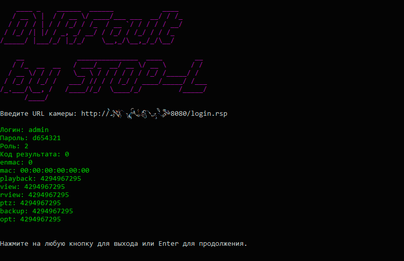

# DVRFaultNET
.NET console application that exploits DVR [CVE-2018-9995 vulnerability](https://www.cve.org/CVERecord?id=CVE-2018-9995)

____
# Usage

Once launched, you will be prompted to enter the URL of the DVR camera. The program add `?opt=user&cmd=list` to the URL and sends a request containing `"Cookie:uid=admin"` header then server return a JSON string provides all users credentials.
